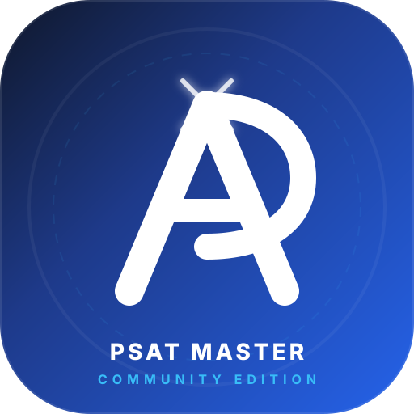

<p align="center">
  
</p>

<h1 align="center">PSAT Master</h1>
<p align="center">
  <strong>A Quiet Sanctuary for the Mind at the Threshold</strong><br />
  <em>An open, zero-friction, distraction-free study suite for the Digital PSAT/NMSQT &amp; SAT.</em>
</p>

<p align="center">
  
  
  
</p>

---

## 🕊️ To the Student at the Threshold: A Letter from Aarti

Dear Learner,

Every year, millions of young minds arrive at a defining threshold. You stand on the edge of your academic future, looking through the lens of standardized exams like the PSAT or the SAT. Ideally, this moment should be one of beautiful, quiet intellectual growth—a period where you refine your reasoning, challenge your capabilities, and begin to grasp the vast boundaries of your own potential.

But when you look around at the tools built to help you cross this threshold, you do not find a school or a library. You find a market. 

You find flashing lights, aggressive monetization popups, paywalls that segment those who can afford guidance from those who cannot, noisy sign-up screens demanding your personal data, and invasive advertisements engineered to fragment your attention. In the eyes of modern educational technology, you are rarely a student to be nurtured; you are a user to be monetized, a metric to be tracked.

I built **PSAT Master** because I believe with every fiber of my being that **your mind deserves a sanctuary.**

This is not a commercial product. It is a quiet, personal promise. It is an act of absolute reverence for your concentration and your future. I wanted to design a place where you could prepare for these exams with zero friction—no login screens, no tracking, no subscription gates, and no noise. Just you, the page, and the beautiful struggle of learning.

---

## 🏛️ The Architecture of Focus

Every single feature of this suite was designed to respect your focus and save your precious energy:

* **🍃 Complete Freedom, No Logins**: You do not need to give away your email, your name, or your data. You simply open the platform, and you begin. Your progress is saved privately and securely on your own device—it belongs entirely to you.
* **📚 2,900+ Rigorous Questions**: A rich, comprehensive archive of reading, writing, and math modules crafted to mirror the actual exam’s standards with absolute fidelity.
* **⚡ Adaptive Smart Drills**: Sprints, timed sessions, and conceptual deep-dives designed to meet you exactly where your understanding currently stands.
* **📓 The Mistake Notebook**: A gentle space to embrace failure. Every incorrect answer is stored not as a penalty, but as an opportunity for deep reflection. You can return to them, dissect the reasoning, and try again until you master the concept.
* **🧮 Integrated Study Tools**: High-performance coordinate graphing planes, quick formula cheat sheets, and a clean Desmos-style scientific calculator sit right at your fingertips to build pure procedural comfort.

---

## 🤝 An Invitation to Join Hands: Let Us Build This Together

This platform is a gift, and it will always remain a **public good**. But to keep it alive, robust, and pristine for generations of students to come, I cannot walk this path alone. I need your help. 

I am asking the global community—educators, software developers, mathematicians, writers, and students—to join hands with me. Let us build and preserve this sanctuary together:

* **If you are a Developer**: Help me optimize the rendering engines, sharpen our local-first offline state machines, and ensure our interface remains beautiful and accessible on any device in the world.
* **If you are an Educator**: Help me write clearer, more intuitive explanation pathways, double-check our math proofs, and ensure our question bank remains the gold standard of academic integrity.
* **If you are a Student**: Use this space. Test the limits of your mind here. Tell me what helps you focus and what gets in your way. When you find ways we can improve, open a pull request or share your feedback.

Let us prove to the world that the finest educational tools do not need to belong to multi-billion dollar corporations or hide behind premium paywalls. Let us build a future where high-quality learning is a universal sanctuary, open to anyone with the courage to learn.

With all my support,  
**Aarti**

---

## 🛠️ Running the Community Edition Locally

To build and run this clean, local environment yourself:

```bash
# Install the core packages
npm install

# Run the local development server
npm run dev
```

To output the standalone production-ready static bundle:

```bash
npm run build
```

---

## 🚀 Deploying to Vercel & Environment Variables

When deploying PSAT Master to Vercel or your production host, configure the following environment variables in your project settings:

### Required Variables
* **`GEMINI_API_KEY`**: Your Google AI Studio API key. Keeps Gemini AI requests secure via server-side execution.
* **`APP_URL`**: Canonical production URL (e.g. `https://psat-master.vercel.app`).

### Optional Firebase Variables (For Cloud Account Sync)
* **`VITE_FIREBASE_API_KEY`**: Public Firebase Web API Key.
* **`VITE_FIREBASE_PROJECT_ID`**: Firebase Project ID.
* **`VITE_FIREBASE_APP_ID`**: Firebase Web App ID.
* **`VITE_FIREBASE_AUTH_DOMAIN`**: Firebase Authentication domain.
* **`VITE_FIREBASE_DATABASE_ID`**: Optional custom database name.

For the complete visual deployment walkthrough, visit our [Deployment & Environment Variables Guide](docs/deployment.html) on the documentation hub.

---

<p align="center">
  <em>Let us build tools that treat the human mind with the dignity it deserves.</em>
</p>
